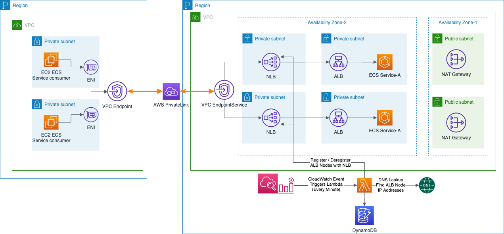

## NLB to ALB integration

### What are we trying to build?

#### Solution - Introduce NLB proxying ALB and using AWS PrivateLink to ensure traffic flows over AWS network, not going over public network

In first AWS Account, call it a SERVICE PROVIDER account
- AWS Network Load Balancer, which sits in front of the Application Load Balancer
- VPC Endpoint Service, hooked up to the NLB

In second AWS Account, call it a CONSUMER account
- VPC Endpoint in another consumer VPC (cross-account) using a VPC Endpoint Service

The CONSUMER Account VPC can talk (via VPC Endpoint) to the NLB in SERVICE PROVIDER account, which forwards request to the Applicaton Load Balancer calling ECS service.

### Pre-requisites
- You need two AWS accounts. Call the first account as Service Provider and second as Service Consumer
- Since we create two EC2 instances in Service Consumer account, you  need to create an EC2 Key Pair.
- In Service consumer account (2nd account), create an IAM user.
- update values in **vars.env** file, change the following
    - VPC_ENDPOINT_PROVIDER_ACCOUNTID  [this is your first account, Service Provider Account, where we will create NLB and ALB]
    - VPC_ENDPOINT_CONSUMER_ACCOUNTID  [this is second account, Service Consumer Account, where you create VPC Endpoint to access NLB in Service Provider Account]
    - VPC_ENDPOINT_CONSUMER_ROLE_NAME [IAM role in Sevice Consumer Account]
    - VPC_ENDPOINT_CONSUMER_USER_NAME [IAM user in Service Service Consumer Account]

### CloudFormation Stacks working and components created using CF
In the **Service Provider AWS account (PROVIDER)**, we have Infra CF stack that creates the following:
- VPC
    - 10.0.0.0/16
- 2 private subnets
    - 10.0.3.0/24
    - 10.0.4.0/24
- 2 public subnets
    - 10.0.1.0/24
    - 10.0.2.0/24
- NAT Gateways, one in each Public Subnet
- Internet Gateway
- Route Tables
    - public route table (0.0.0.0/0)
    - private route table: first private subnet is associated with it
        - allows outgoing internet traffic via NatGateway-1
    - private route table: second private subnet is associated with it
        - allows outgoing internet traffic via NatGateway-2
- ECS Cluster
- Security Gropup for Application Load Balancer
    - Allowing tcp protocols on port 80 from 0.0.0.0/0
- Application Load Balancer enabled in 2 Private Subnets
    - Temporary Target Group
        - Health check Protocol & Port : HTTP / 80
    - Listener: default forwards to Temporary Target Group
- Security Group for ECS Service Tasks that allows traffic from Application Load Balancer on port 8081
- ECS Task IAM Role and Task Execution IAM role

In the **Service Provider AWS account (PROVIDER)**, we have Infra ECS Service CF Stack that creates the following:
- Application Load Balancer (enabled for Private Subnets) 
    - ECS Service A Target Group 
        - Health Check on HTTP / 80 and path is : /service/healthcheck
    - Listener Rule which forwards request to Service A Target Group when 
        - Path Pattern is /service/*
        - Has Request Header "Call-Service"
- ECS Service A Task Definition with container image service A (takes it from the Docker Hub)
- ECS Service A
    - with Task Security Group that allows traffic from Application Load Balancer Security Group
    - in Private Subnet 1 and 2
    - with private Application Load Balancer

## Solution Details
In the **Service Provider AWS account (PROVIDER)**, we have Network Load Balancer CF stack that creates the following
- Network Load Balancer enabled for 2 Public Subnets
- Network Load Balancer Target Group
- Network Load Balancer Listener rule that listens on port 80 for TCP protocol and forwards requests to Network Load Balancer Target Group
- VPC Endpoint Service for Network Load Balancer (which is enabled for 2 Public Subnets)
    - whilelists **Consumer AWS Account** for an IAM ROLE and IAM User
- Lambda Function which does the DNS lookup for Application Load Balancer (running in 2 Private Subnets) nodes IP address and register those IP addresses with Network Load Balancer Target Group dynamically.
- CloudWatch Event Rule which triggers the DNS Lookup and Target Register Lambda every minute.
- Lambda Resource Policy which allows CloudWatch Events (Principal: events.amazonaws.com) to invoke Lambda function.
- Lambda Execution Role for Lambda function to create and write CloudWatch Logs, access S3 Bucket to write DNS Lookup result (Application Load Balancer IP Addresses) in the S3 bucket, register & deregister IP Targets with Network Load Balancer Target Group.

### Scratch Pad Notes

#### List VPC Endpoint Services accessible to CONSUMER aws account
aws ec2 describe-availability-zones --region ap-southeast-2

#### Curling ECS via NLB - ALB - ECS
curl http://nlb-a-Netwo-1GJCQ107QC2FP-72c108925e5b89ca.elb.ap-southeast-2.amazonaws.com/service/democall

#### Stress Test the Solution using Apache HTTP server benchmarking tool

- install Apache HTTP server benchmarking tool on EC2 instance in the private subnet in Service Consumer account
    - sudo yum install httpd-tools
- Perform Stress Test: the following will send 1.5 million http requests, 1000 concurrent requests to your Private NLB via VPC Endpoint
    
    - ab -n 1500000 -c 1000 http://VPC_ENDPOINT/service/democall

    - replace VPC Endpoint DNS endpoint with your environment VPC Endpoint DNS

#### useful links

https://aws.amazon.com/blogs/networking-and-content-delivery/using-static-ip-addresses-for-application-load-balancers/

