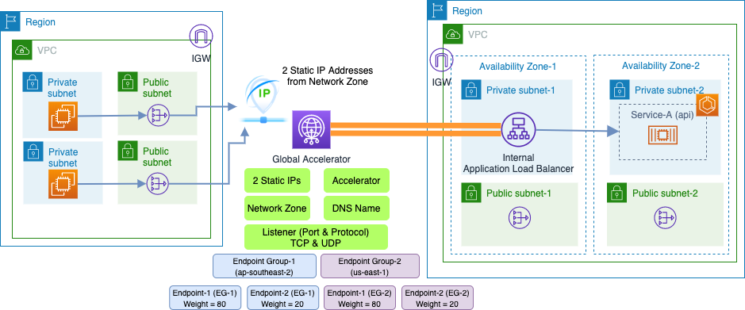

### Expose Internal Application Load Balancer via Global Accelerator

- When you set up your accelerator with Global Accelerator, you associate your static IP addresses to regional endpoints—Network Load Balancers, Application Load Balancers, Amazon EC2 instances, or Elastic IP addresses—in one or more AWS Regions. 

- The static IP addresses accept incoming traffic onto the AWS global network from the edge location that is closest to your users.

- Two types of endpoints can preserve the source IP address of the client in incoming packets: Application Load Balancers and Amazon EC2 instances

- Global Accelerator does not support client IP address preservation for Network Load Balancer and Elastic IP address endpoints.

- When you add an accelerator, security groups and AWS WAF rules that you have already configured continue to work as they did before you added the accelerator.

#### Scratch Pad notes

https://aws.amazon.com/blogs/networking-and-content-delivery/using-aws-cloudformation-with-aws-global-accelerator/

https://aws.amazon.com/blogs/networking-and-content-delivery/improving-availability-and-performance-for-application-load-balancers-using-one-click-integration-with-aws-global-accelerator/

