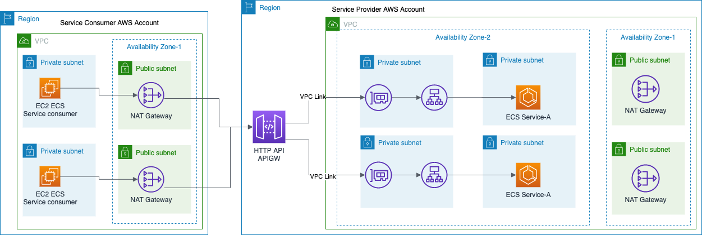

### Export Internal Application Load Balancer via API Gateway HTTP API - VPC Link

#### Steps to build this

- You need two AWS accounts
    - First account, let's call it Service Provider account 
        - Will host Private Network Load Balancer, Reverse Proxy on EC2 (NGINX), Private/Internal Application Load Balancer and ECS Cluster & Service
    - Second account, let's call it a Service Consumer account
        - Will host EC2 instance (consumer of service deployed in ECS)

   
- cd solution-3-ReverseProxy-nlb
- update vars.env with required values
    - PROJECT_NAME= <any random name>
    - SERVICE_A_IMAGE=<Do Not Change>
    - SERVICE_A_PORT=<Do Not Change>
    - AWS_PROVIDER_PROFILE=<Do Not Change>
    - AWS_CONSUMER_PROFILE=<Do Not Change>
- Service Provider Account
    - VPC_ENDPOINT_PROVIDER_ACCOUNTID=<AWS Account ID of Service Provider Account, first account>
    - KEY_PAIR_PROVIDER_ACCOUNT=<EC2 Keypair in Service Provider Account>
- Service Consumer Account
    - VPC_ENDPOINT_CONSUMER_ACCOUNTID=<AWS Account ID of Service Consumer Account, second account>
    - VPC_ENDPOINT_CONSUMER_ROLE_NAME=<Role in Service Provider Account, with admin rights - Just for this exercise, not recommended for Production account>
    - VPC_ENDPOINT_CONSUMER_USER_NAME=<Username in Service Provider Account, with admin rights - Just for this exercise, not recommended for Production account>
    - KEY_PAIR_CONSUMER_ACCOUNT=<EC2 Keypair in Service Consumer Account>

- after you have updated **vars.env**

- Open ssh terminal on your local machine

- $ source vars.env

- ./deploy.sh

    - it will deploy stacks in both the accounts

- Once deployment is completed

- Ssh into bastion host in Service Consumer account (look for EC2 instance with Public IP address in Service Consumer Account) using EC2 Keypair that you created in the consumer account

- Once you are logged in to bastion host, copy EC2 Keypair from your local machine into bastion host.

- Ssh into private EC2 instance from your bastion host

- Test calling ECS service deployed in Service Provider account

    - Go to VPC console
    - Click on VPC Endpoints in the left menu
    - Copy VPC Endpoint DNS Address
     
- $ curl http://<VPC Endpoint DNS Address>/service/democall

#### Scratch Pad notes

service nginx status
sudo systemctl restart nginx

https://medium.com/swlh/aws-api-gateway-private-integration-with-http-api-and-a-vpc-link-602360a1cd84

https://medium.com/avmconsulting-blog/http-apis-in-aws-api-gateway-82572e4ddd65

